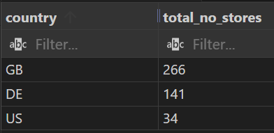
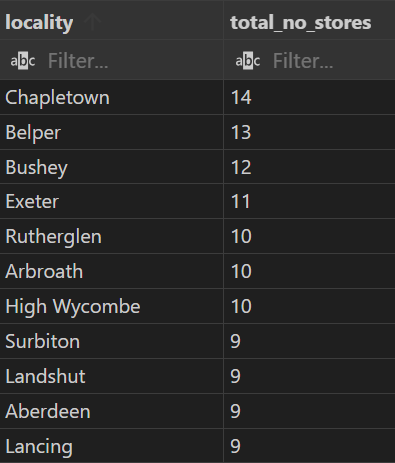
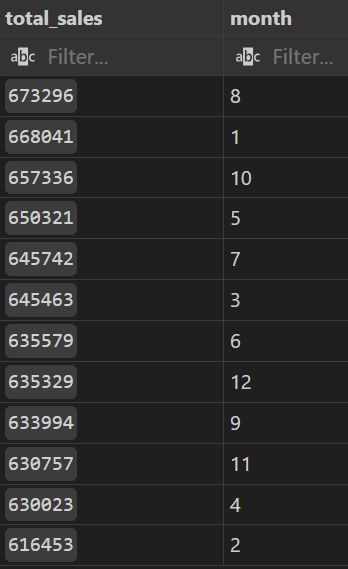
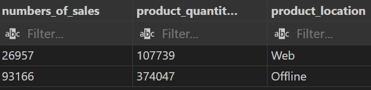
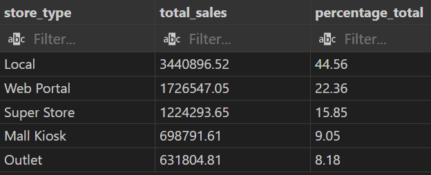
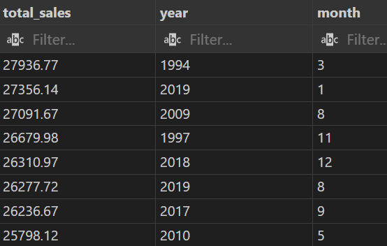
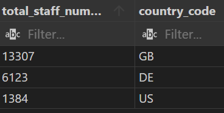
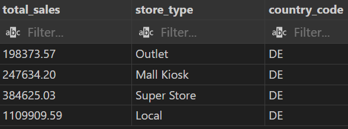
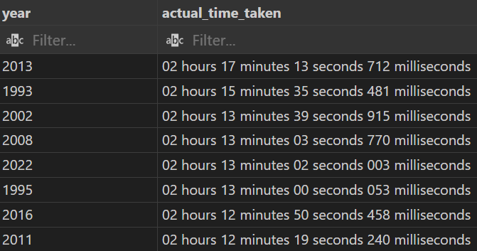

# Multinational Retail Data Centralisation

## Table of Contents
1. [Project Description]
2. Installation Instructions
3. Usage Instructions
4. File Structure
5. SQL Query Results
6. License Information

## Project Description
Project to make the sales data of a company more accessible from one centralised location. The first step is to produce a system to store the current company data in a database so that it is accessed from one centralised location and act as a single source for all sales data. The second part is to query the database to get up-to-date metrics for the business.

## Installation Instructions
To install and run this project:

1. Clone the repository or download the files to your local machine
```
    git clone https://github.com/B-M-S-West/multinational-retail-data-centralisation.git
```
2. Make sure you have a 'db_creds.yaml' and 'local_db_creds.yaml' file so that you can access the database in your root system
-   Create a YAML file for each
-   Add the following content to each and replace with the database credentials
```
    username: your_username
    password: your_password
    host: your_host
    port: your_port
    database: your_database
```
3. Ensure you have Python installed on your machine.
4. Configure your environment
    Required python packages - Pandas, Numpy, boto3, pyyaml, sqlalchemy, tabula, requests, os
5. Run the script using a Python interpreter.

## Usage Instructions
To use the program:

1. Run the script by using the following in your terminal
```
    python __main__.py
```
2. Once this has run you can then run 'database.sql' to make adjustments to the database
3. Each of the files in the 'queries' folder can be run to access the data

## File Structure
The project has the following structure:

- `__main__.py`: This is the main Python script that you run to run through the program.
- `data_cleaning.py`: This is the Python script that performs the cleaning of the different data.
- `data_extraction.py`: This is the Python script that performs the extraction of the data from the different sources.
- `database_utils.py`: This is the Python script that connects to the database and uploads
- `db_creds.yaml`: This contains the details to access the original database
- `local_db_creds.yaml`: This contains the details to access the database on the local area 
- `database.sql`: This contains the SQL statements that make the alterations to the table and set primary and foreign keys
- `queries`: folder containing the following file that each query the database to answer different questions:
    - `task_1_number_of_stores.sql`: How many stores do the business have and in which countries?
    - `task_2_number_of_stores_in_region.sql`: Which locations have the most stores?
    - `task_3_number_of_sales_per_month.sql`: Which months produce the most sales overall time of records?
    - `task_4_online_vs_offline.sql`: How many sales come online?
    - `task_5_percent_of_sails.sql`: What percentage of sales come through each type of store?
    - `task_6_revenue_by_month_year.sql`: Which month in the year produced the most sales?
    - `task_7_staff_count.sql`: What is the staff count?
    - `task_8_german_store_type.sql`: Which German store is selling the most?
    - `task_9_average_time_to_get_an_order.sql`: How quickly the company is making sales?

## SQL Query Results
1. The Operations team would like to know which countries we currently operate 
in and which country now has the most stores.



2. The business stakeholders would like to know which locations currently have the most stores.
They would like to close some stores before opening more in other locations.
Find out which locations have the most stores currently.



3. Query the database to find out which months have produced the most sales.



4. The company is looking to increase its online sales.
They want to know how many sales are happening online vs offline.
Calculate how many products were sold and the amount of sales made for online and offline purchases.



5. The sales team wants to know which of the different store types is generated the most revenue so they know where to focus.
Find out the total and percentage of sales coming from each of the different store types.



6. The company stakeholders want assurances that the company has been doing well recently.
Find which months in which years have had the most sales historically.



7. The operations team would like to know the overall staff numbers in each location around the world.
Perform a query to determine the staff numbers in each of the countries the company sells in.



8. The sales team is looking to expand their territory in Germany. 
Determine which type of store is generating the most sales in Germany.



9. Sales would like the get an accurate metric for how quickly the company is making sales.
Determine the average time taken between each sale grouped by year.



## License Information
This project is licensed under the MIT License. See the LICENSE file for details.
